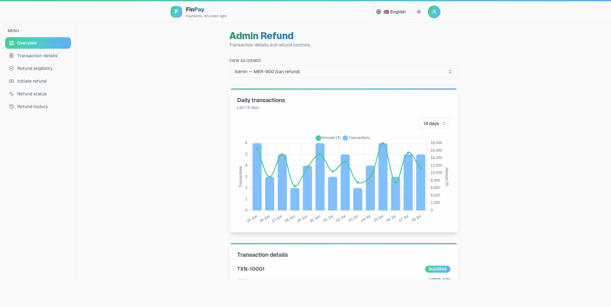
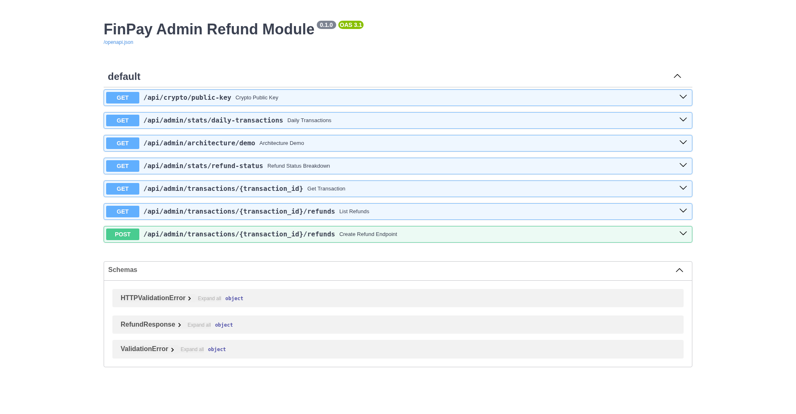

# FinPay Admin Refund Module

Full-stack implementation of the FinPay admin refund feature for the Sr. Full Stack
Developer AI-assisted assessment.

- **Backend:** Python 3.8 · FastAPI · SQLModel · SQLite
- **Frontend:** Next.js (App Router) · React · Tailwind CSS · shadcn/ui · Chart.js
- **Tests:** pytest (26 tests, all passing)

## Screenshots

### Admin dashboard (Next.js — `http://localhost:3100`)


### API docs (FastAPI Swagger UI — `http://localhost:8100/docs`)


## Repository map

| Path | What it is | Task |
|---|---|---|
| `CLAUDE.md` | Always-on AI context + frozen business rules | 1 |
| `AI_WORKFLOW.md` | How AI is used safely on this codebase | 1 |
| `.agents/skills/safe-fintech-change/SKILL.md` | Skill: inspect-first, smallest safe change | 6 |
| `.agents/skills/anti-overengineering-review/SKILL.md` | Skill: complexity review | 6 |
| `.cursor/rules/fintech-development.mdc`, `.cursorignore` | Cursor rules + secret exclusion | 1 |
| `backend/` | FastAPI app, models, auth, refund logic, tests | 2, 8 |
| `frontend/` | Next.js refund UI | 3 |
| `ARCHITECTURE.md` | Transfer-flow architecture, service components, money-reliability concepts | — |
| `ENCRYPTION.md` | TLS + app-layer payload encryption (design + how to run HTTPS) | — |
| `BACKEND_FASTAPI_NOTES.md` | FastAPI-for-Express dev reference (pattern mapping) | — |
| `ISSUES_AND_FIXES.md` | Problems hit + fixes (CORS, build cache, etc.) | — |
| `DESIGN_IDEMPOTENCY.md` | Idempotency & concurrency design | 4 |
| `CODE_REVIEW.md` | Review of the flawed AI code | 7 |
| `AI_PROMPT_LOG.md` | Prompt log | 5 |
| `FINAL_SUMMARY.md` | Final summary, risks, trade-offs | 9 |

## Run the backend

```bash
cd backend
python3 -m venv .venv
. .venv/bin/activate
pip install -r requirements.txt
uvicorn main:app --reload --port 8000
```

- API docs (Swagger UI): http://localhost:8000/docs
- Seeded transactions: `TXN-10001` (SUCCESS, ₹5000, MER-900), `TXN-FAILED`, `TXN-USD`.

### Dev tokens (stand-in for real auth)
| Token | Can refund? | Merchant scope |
|---|---|---|
| `admin-token` | yes | MER-900 |
| `superadmin-token` | yes | all |
| `support-noperm-token` | no | MER-900 |
| `other-merchant-token` | yes | MER-111 (not MER-900) |

### Example
```bash
curl -X POST localhost:8000/api/admin/transactions/TXN-10001/refunds \
  -H "Authorization: Bearer admin-token" \
  -H "Idempotency-Key: refund-abc-123" \
  -H "Content-Type: application/json" \
  -d '{"amount": 1000, "reason": "Customer requested partial refund"}'
```

## Run the tests

```bash
cd backend
. .venv/bin/activate
pytest -q
```

## Run the frontend

```bash
cd frontend
npm install
# Point the UI at the backend (defaults to http://localhost:8000):
echo "NEXT_PUBLIC_API_URL=http://localhost:8000" > .env.local
npm run dev   # http://localhost:3000
```

The page shows transaction `TXN-10001`, a role switcher (to demo the permission-based
disabled state), the refund modal, and refund history. The backend must be running.

> Note: if port 8000 is busy, run the backend on another port and set
> `NEXT_PUBLIC_API_URL` to match.

## Frontend vs backend validation

| Check | Frontend (UX) | Backend (authoritative) |
|---|---|---|
| Amount > 0 | ✅ instant feedback | ✅ enforced (Pydantic + logic) |
| Amount ≤ remaining | ✅ instant feedback | ✅ enforced (over-refund check) |
| Reason present | ✅ | ✅ |
| Auth / permission / merchant scope | button disabled | ✅ **enforced** (401/403) |
| Eligibility (SUCCESS, INR) | button disabled | ✅ **enforced** (409/422) |
| Over-refund under concurrency | — | ✅ **enforced** (row lock + total) |
| Idempotency / duplicate | reuse one key | ✅ **enforced** (replay / 409) |

Frontend validation only improves UX; the backend re-checks everything and is the source
of truth.
